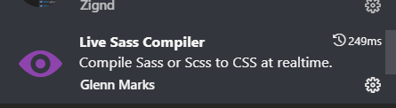

# Dự án Pitch man

## Các công nghệ sử dụng 
- HTML,CSS,JS

## Các run project

- Download Extension IDE VSCODE: `Golive`,  `Live Sass Compiler`,  `Live Server`,

- bật file home.html -> bật Golive ở thanh dưới VSCODE
- bật file style.css -> ấn Watch Sass để compile ra CSS 
- Lưu ý : sửa CSS vào file theo từng page đuôi `.scss` để sửa không sửa vào file `CSS`